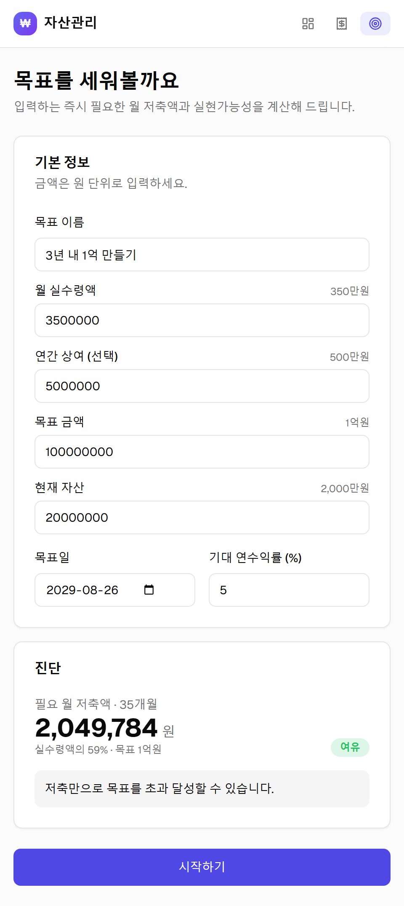
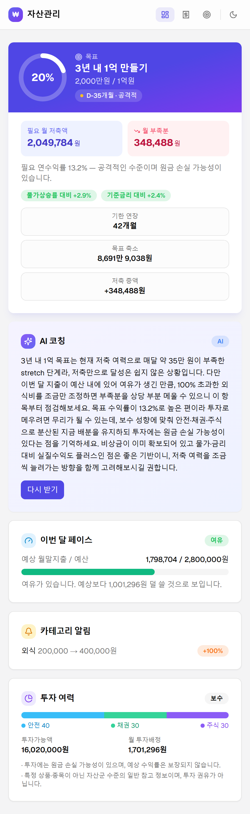
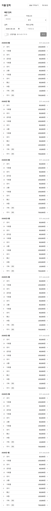
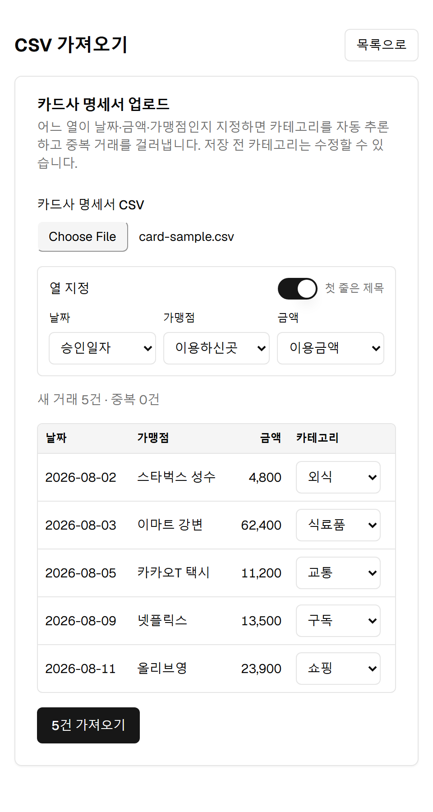
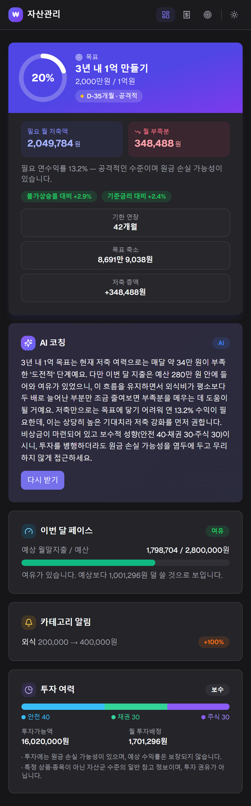

# 자산관리 (asset-manager)

[](LICENSE)

목표 금액과 기한을 넣으면 **매달 얼마를 저축·소비·투자해야 하는지 계산**하고, 실제 지출을 추적해 **이번 달이 빡빡한지 여유로운지 월중에 판정**하는 개인 자산관리 앱.

기존 가계부는 "얼마 썼다"를 기록한다. 이 앱은 **"목표 대비 지금 페이스가 맞는가"** 를 판정한다.

> 설계 원칙: **숫자는 코드가, 말은 AI가.** 모든 금액·비율 계산은 `src/core`의 순수 함수가 담당하고, LLM은 그 결과를 자연어로 설명만 한다.

---

## 주요 기능

| 기능 | 설명 |
|---|---|
| 목표 계산 | 복리 반영 필요 월 저축액, **필요수익률 역산**(이분법)으로 실현가능성 4단계 판정 |
| 대안 제시 | 목표가 비현실적이면 기한연장 / 목표축소 / 저축증액 3가지 대안 |
| 월중 페이스 | 경과일 외삽으로 tight / ok / surplus 신호 (월말 아니라 월중에) |
| 카테고리 이상 탐지 | 최근 3~6개월 **중앙값** 대비 편차 (평균 아님 — 1회성 지출 오염 방지) |
| 투자 여력 | 비상금 확보 후 잉여 + 기간별 참고 배분 (자산군 수준까지만) |
| 실질수익률 | 물가상승률·기준금리 대비 자산 가치 유지 여부 (피셔 방정식) |
| AI 코칭 | 계산 결과를 Claude로 자연어 리포트화 + **규칙 기반 폴백**(오프라인 대비) |
| CSV 임포트 | 카드사 명세서: 열 매핑 UI + 카테고리 자동 추론 + 중복 감지 |

---

## 화면

| 온보딩 — 입력 즉시 진단 | 대시보드 — 진척·페이스·투자·AI 코칭 |
|:---:|:---:|
|  |  |
| **지출 입력 — 빠른 입력 + 고정 토글** | **CSV 가져오기 — 매핑·자동 분류·중복 감지** |
|  |  |

🌙 **다크 모드 지원** — 우측 상단 토글로 전환 (시스템 설정 자동 감지)



---

## 기술 스택

- **Next.js 15** (App Router) + TypeScript strict
- **Prisma + SQLite** (로컬 우선 — 개인 금융 데이터 보호)
- **Tailwind CSS + shadcn 스타일** UI 프리미티브
- **Vitest** (계산 엔진 단위 테스트, 98개)
- **Anthropic API** (서버 라우트에서만 호출)

---

## 폴더 구조

```
src/
  core/                 ← 순수 함수만. React·DB·네트워크 의존성 0
    types.ts
    goal-engine.ts        목표·필요저축·필요수익률·대안
    spending-analyzer.ts  월중 페이스·이상 탐지·반복결제 처리
    investment-advisor.ts 성향·비상금·투자 여력·가드레일
    purchasing-power.ts   실질수익률(물가·기준금리 대비)
    csv-import.ts         CSV 파싱·카테고리 추론·중복 감지
    __tests__/
  server/
    ai-coach.ts         ← Claude API 호출 + 규칙 기반 폴백
  lib/                  ← DB 클라이언트, 분석 오케스트레이션, 포맷
  app/                  ← 온보딩 · 대시보드 · 지출입력 · CSV 임포트
  components/ui/        ← Button, Card, Input, Badge, Progress, Switch …
prisma/
  schema.prisma         User / IncomeProfile / Goal / Account / Transaction
  seed.ts               최근 7개월 시드(104건)
scripts/
  verify-engines.ts     시드 데이터로 엔진 실동작 확인
docs/SPEC.md            제품 명세서
CLAUDE.md               개발 상시 지침
```

`core/`는 프레임워크에서 완전히 분리돼 있어 나중에 React Native로 모바일 앱을 만들 때 통째로 재사용할 수 있다.

---

## 시작하기

```bash
npm install

# 환경 변수
cp .env.example .env
#   DATABASE_URL="file:./dev.db"   (기본값)
#   ANTHROPIC_API_KEY=...          (선택 — 없으면 AI 코칭은 규칙 기반 폴백)

# DB 초기화 + 시드
npx prisma migrate dev
npm run seed

# 개발 서버
npm run dev            # http://localhost:3000
```

흐름: **목표 세우기(온보딩) → 대시보드 → 지출 입력 → CSV 가져오기**

---

## 명령어

```bash
npm run dev          # 개발 서버
npm run build        # 프로덕션 빌드
npm test             # Vitest (전체)
npm run test:watch
npm run seed         # 시드 데이터 생성
npm run verify       # 시드로 엔진 실동작 확인
npx prisma studio    # DB 뷰어
```

---

## 설계 규칙 (요약)

- **LLM에게 계산을 시키지 않는다.** 비율은 엔진에서 미리 퍼센트로 변환해 넘긴다.
- **`src/core`는 순수 함수만.** `Date.now()` 직접 호출 금지 — 현재 시각은 인자로 주입.
- **금액은 원 단위 정수.** 부동소수점 금지, 표시 직전에만 `toLocaleString('ko-KR')`.
- **계산 로직에는 테스트를 함께.** `SPEC.md §5` 검증값을 그대로 사용.
- **금융 가드레일.** 특정 종목·상품·코인 추천 금지(자산군까지만), 투자 출력에 원금 손실 가능성 명시, 사용자를 다그치지 않고 다음 행동 제시.
- **API 키는 서버 사이드에서만.** `NEXT_PUBLIC_` 접두사 금지.

자세한 명세는 [`docs/SPEC.md`](docs/SPEC.md), 개발 지침은 [`CLAUDE.md`](CLAUDE.md) 참조.

---

## 라이선스

[MIT](LICENSE) © 2026 heesub
